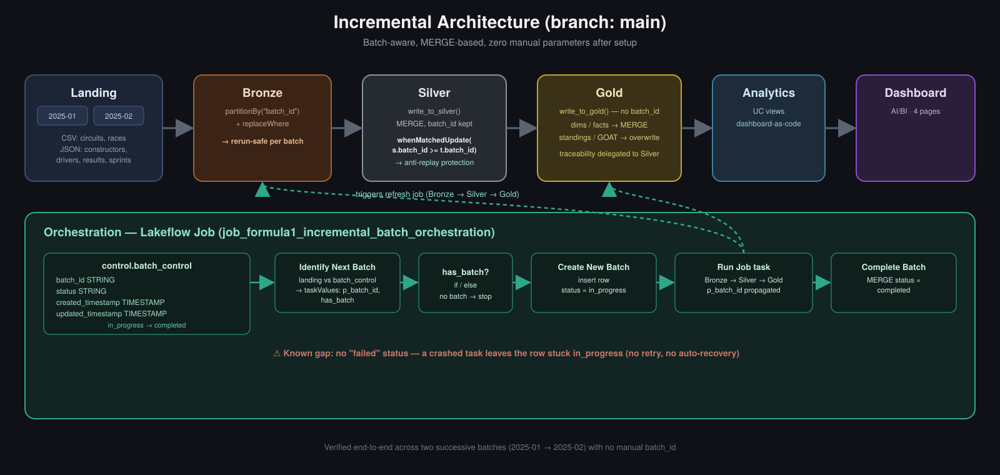

# Formula 1 Data Lakehouse — Azure Databricks

A production-style, incrementally-orchestrated data lakehouse built on Azure Databricks, processing Formula 1 historical data through a full Medallion Architecture — from raw file ingestion to BI-ready dashboards, with automated batch orchestration and no manual parameters required after the first run.

## Why this project

Most tutorial pipelines stop at "load some data and aggregate it once." This project was built to answer a different question: **what does it take to run this reliably, every day, without a human clicking "run" with the right batch_id?**

That meant going beyond the course material it started from:
- Replacing full-overwrite logic with `MERGE`-based incremental writes at every layer, including on data (drivers, circuits) that looks static but isn't guaranteed to arrive that way
- Building a stateful batch-tracking system (`batch_control` table) so a job can detect on its own which batch hasn't been processed yet
- Preserving the original full-refresh pipeline on a separate Git branch instead of duplicating folders, keeping `main` clean and interview-showable
- Turning dashboard logic into versioned Unity Catalog views instead of inline SQL buried in a dashboard export

## Architecture

| Full Load | Incremental |
|---|---|
|  |  |

See [`docs/architecture.md`](docs/architecture.md) for the full breakdown, and [`docs/branching-strategy.md`](docs/branching-strategy.md) for why full-load and incremental live on separate branches rather than separate folders.

## Key Design Decisions

**MERGE over overwrite, even for "static" data.**
Drivers, circuits, and constructors rarely change — but "rarely" isn't "never," and reruns/out-of-order batches happen. Every Silver and non-aggregated Gold write uses `DeltaTable.merge()` rather than overwrite, so the pipeline is safe to rerun without manual cleanup.

**Anti-replay protection lives in Silver, not Gold.**
The Silver `MERGE` condition includes `s.batch_id >= t.batch_id`, which guarantees an older batch can never overwrite newer data. Gold inherits this guarantee from Silver and doesn't repeat the check — Gold tables don't carry `batch_id` at all, since aggregation makes a single batch identifier semantically meaningless anyway.

**Gold layer rule:** no aggregation → `MERGE`; aggregation → full overwrite. Dimension and fact tables (`dim_drivers`, `fact_session_results`) merge incrementally; standings and "greatest of all time" views recompute from the full Gold layer since they aggregate across all history.

**`created_timestamp` is immutable.** Set once on insert, excluded from every `MERGE ... UPDATE SET` clause — a small but deliberate audit discipline.

**Dashboard as code.** The AI/BI dashboard consumes Unity Catalog views built and versioned as notebooks (`05-analytics/`), not ad-hoc SQL typed into the dashboard UI. The `.lvdash.json` export is versioned alongside them for full reproducibility.

**Custom `greatness_score` metric** (`championships × 100 + wins × 10 + podiums × 3`) — designed specifically to correct for the fact that F1's points system has changed multiple times across history, so raw career points aren't a fair cross-era comparison.

## Repository Structure

```
Formula1-Azure-Databricks-Pipeline/
│
├── README.md
├── LICENSE
├── .gitignore
│
├── 00-common/                          # Reusable across every run: env vars, helper functions
│   ├── 01.environment-config.ipynb
│   ├── 02.bronze-helpers.ipynb
│   ├── 03.silver-helpers.ipynb
│   └── 04.gold-helpers.ipynb
│
├── 01-setup/                           # One-time infrastructure provisioning
│   └── 01.Setup Project Environment.ipynb
│                                        #   - External location, catalog, schemas, landing volume
│
├── 02-bronze/                          # Raw ingestion, one notebook per source file
│   ├── 01.Ingest Circuits File.ipynb
│   ├── 02.Ingest Races File.ipynb
│   ├── 03.Ingest Constructors File.ipynb
│   ├── 04.Ingest Drivers File.ipynb
│   ├── 05.Ingest Results File.ipynb
│   └── 06.Ingest Sprints File.ipynb
│
├── 03-silver/                          # Cleaned, conformed, MERGE-based
│   ├── 01.Transform Circuits Data.ipynb
│   ├── 02.Transform Races Data.ipynb
│   ├── 03.Transform Constructors Data.py
│   ├── 04.Transform Drivers Data.py
│   ├── 05.Transform Results Data.ipynb
│   └── 06.Transform Sprints Data.py
│
├── 04-gold/                            # Star schema: dimensions + facts
│   ├── 01.Build Races Dimension.py
│   ├── 02.Build Constructors Dimension.py
│   ├── 03.Build Drivers Dimension.py
│   ├── 04.Build Results Fact.py
│   └── 91.Build Nationality Region Reference.py
│                                        #   91+ = reference/utility tables, outside the
│                                        #   sequential pipeline numbering on purpose
│
├── 05-analytics/                       # Dashboard-as-code: Gold-layer views
│   ├── 01.Build Driver Standings View.sql
│   ├── 02.Build Constructor Standings View.sql
│   ├── 03.Build GOAT Drivers View.ipynb
│   └── 04.Build GOAT Constructors View.ipynb
│
├── 06-orchestration/                   # Stateful, parameter-free batch orchestration
│   ├── 00.Create Control Tables.py
│   ├── 01.Identify Next Batch.py
│   ├── 02.Create New Batch.py
│   └── 03.Complete Batch.py
│
├── analytics/
│   └── dashboards/
│       └── formula_one_analytics.lvdash.json
│
├── data/
│   └── sample-batches/                 # Real batches used during testing (CSV + JSON)
│       ├── 2025-01/
│       └── 2025-02/
│
├── assets/
│   ├── architecture/
│   │   ├── architecture-full-load.png
│   │   ├── architecture-incremental.png
│   │   └── architecture-overview.png
│   └── screenshots/
│       ├── platform/                   # unity-catalog, lakeflow-job, delta-tables, control-table
│       └── dashboards/                 # driver_standings, dominant_drivers, etc.
│
└── docs/
    ├── architecture.md
    ├── incremental-processing.md
    ├── orchestration.md
    └── branching-strategy.md
```

## Pipeline Layers

**Bronze** — Raw files land in an ADLS Gen2 volume, one folder per batch. Each ingestion notebook writes to Bronze with `partitionBy("batch_id")` and `replaceWhere`, so re-ingesting a batch never touches other batches' data.

**Silver** — Cleaning, type casting, and deduplication, written via `write_to_silver()`, a reusable helper wrapping `DeltaTable.merge()`. Every Silver table carries `batch_id` and the anti-replay `s.batch_id >= t.batch_id` condition described above.

**Gold** — Star schema (`dim_races`, `dim_constructors`, `dim_drivers`, `fact_session_results`) built via `write_to_gold()`, a simplified helper with no `batch_id` handling — that guarantee is delegated upstream to Silver. Follows the MERGE-vs-overwrite rule stated above.

**Analytics** — Unity Catalog views over Gold, feeding a 4-page AI/BI dashboard: Driver Championship Standings, Constructor Championship Standings, Dominant Drivers of All Time, Dominant Constructors of All Time.

Full detail in [`docs/incremental-processing.md`](docs/incremental-processing.md).

## Incremental Orchestration

The pipeline runs with **zero manual parameters** after the first execution. A master Lakeflow Job (`job_formula1_incremental_batch_orchestration`) does the following on every trigger:

1. **`01.Identify Next Batch`** — compares batches present in the landing volume against a `control.batch_control` table (statuses: `in_progress` / `completed`) to find the one unprocessed batch, and exposes it to downstream tasks via `dbutils.jobs.taskValues`.
2. **Native if/else control flow** — checks whether a new batch was found (`has_batch`).
3. **`02.Create New Batch`** — inserts a new `in_progress` row into `batch_control` (batch_id passed dynamically, never hardcoded).
4. **Run Job task** — triggers the child incremental-refresh job (Bronze → Silver → Gold), with `p_batch_id` propagated automatically as a job-level parameter.
5. **`03.Complete Batch`** — `MERGE`s the row's status to `completed` and updates `updated_timestamp`.

Tested end-to-end across two successive runs (batch `2025-01`, then `2025-02` dropped into landing) with no manual intervention between them — the job detected and processed only the new batch each time.

Full detail, including the control table schema, in [`docs/orchestration.md`](docs/orchestration.md).

## Prerequisites & Setup

**This is not a "clone and run locally" project.** It was built and tested on Azure Databricks, and reproducing it requires:
- An Azure Databricks workspace with **Unity Catalog** enabled
- Access to an **ADLS Gen2** storage account (for the external location)
- Permissions to create catalogs, schemas, external locations, and volumes

If you have that environment available, the pipeline reproduces as follows:

1. Run `01-setup/01.Setup Project Environment.ipynb` once — creates the external location, catalog, `landing`/`bronze`/`silver`/`gold` schemas, and the landing volume.
2. Set environment variables in `00-common/01.environment-config.ipynb` (catalog name, control schema — never hardcoded elsewhere in the codebase).
3. Run `06-orchestration/00.Create Control Tables.py` once to create the `batch_control` table.
4. Upload a batch folder from [`data/sample-batches/`](data/sample-batches/) to the landing volume, then trigger the orchestration job. Repeat with the next batch folder — no parameters needed.

Two real batches used during testing are included under `data/sample-batches/` (`2025-01`, `2025-02`), each a full snapshot (CSV + JSON) of circuits, races, drivers, constructors, results, and sprints for that period — enough to see the orchestration correctly process one new batch per run without any manual `batch_id`.

## Dashboards

| Driver Standings | Constructor Standings |
|---|---|
|  |  |

| Dominant Drivers | Dominant Constructors |
|---|---|
|  |  |

## Known Limitations & Next Steps

The orchestration layer works reliably for the happy path but has gaps identified during build, not covered by the original course material:

- No `failed` status — a task failure doesn't currently flag the batch as failed, only as stuck `in_progress`.
- No automatic retry on task failure.
- No automatic recovery for a batch left `in_progress` after a crash (would need to be manually reset).

These are left as deliberate next steps rather than hidden — a natural extension would be a status-check task at the start of the orchestration job that detects and resets stale `in_progress` batches past a timeout threshold.

## Tech Stack

Azure Databricks · Unity Catalog · Delta Lake · PySpark · SQL · Lakeflow Jobs · ADLS Gen2 · AI/BI Dashboards

## License

See [LICENSE](LICENSE).
